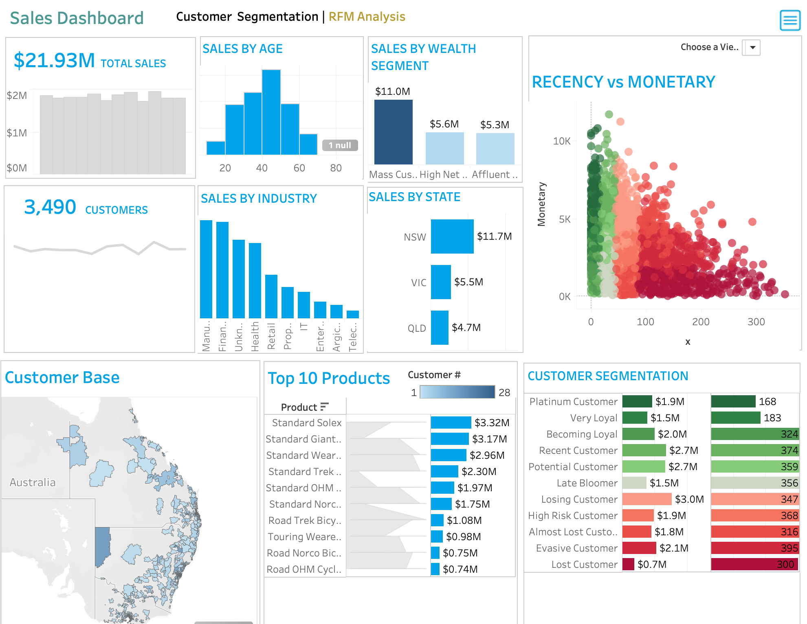
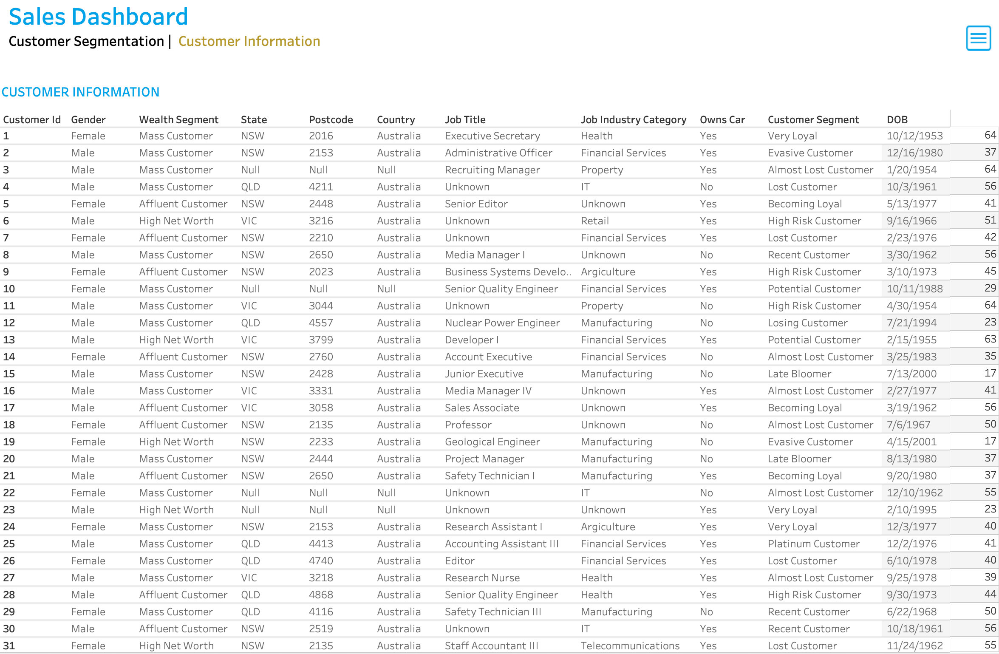

# Data Analytics Customer Segmentation

## Goal of the project
The purpose of this project is to conduct a Customer Segmentation Analysis for an Automobile bike Company, Sprocket Central Pty Ltd, trading across New South Wales, Victoria and Queensland. Customer segmentation is performed by developing a RFM Model. RFM (Recency, Frequency, Monetary) analysis is a behavior-based approach grouping customers into segments. It groups the customers on the basis of their previous purchase transactions. In this analysis 3,490 customers were divided into 11 segments. The analysis will help in determining which customer segments should be targeted in order to enhance sales revenue for the company. A <b>Sales Dashboard for Customer Segmentation</b> is developed using <b>Tableau</b> and the data quality assessment and analysis is done using <b>Python</b>.

## Tableau Dashboard
The Sales Dashboard for Customer Segmentation is built in Tableau Desktop 2025.1 and is available in this repository as `cutomer-segmentation-dashboard.twbx`. It has two pages. The first is an RFM overview and the second is a customer level detail page with nine filters. 
 
 

The two pages read from two data sources at different grains. `Customer_Trans_RFM_Analysis.csv` holds 3,490 rows at one row per customer and `Transactions_Cleaned.csv` holds 19,801 rows at one row per transaction. They are deliberately not joined or blended because joining them repeats each customer once per transaction and inflates every total.

## Analysis Approach
### 1. Data Quality Assessment and Data Cleaning
The first step towards generating useful insights from the data was the data preparation, quality assessment and data cleaning step. After the cleaning process exploratory data analysis on the dataset and identification of customer purchasing behaviours to generate insights can be performed.

In the data cleaning step the data quality of the following datasets were first assessed. After a data quality assessment the following data quality issues were observed and the necessary process to mitigate the issue was followed :
- <b>CustomerDemographic.xlsx</b> :
  - 1 irrelevant column was present and was dropped. The `default` column held strings from the Big List of Naughty Strings such as script tags and shell injection payloads. It was test data left in the extract and not a customer attribute.
  - There were 6 columns where missing values were present. Based on the volume of missing values either the records were left in place or appropriate values were imputed. `job_title` at 12.7% and `job_industry_category` at 16.4% were filled with `Unknown` because there were too many to drop and too varied to impute. `DOB` and `Age` and `tenure` at 2.2% were left null because charts skip nulls and imputing a birth date invents a customer.
  - For the gender column there was no standardisation of data. Six distinct values were recorded for what should be three. `F` and `Femal` were mapped to Female and `M` was mapped to Male. The 88 `U` records were kept as `Unknown` rather than guessed.
  - The Date of Birth column was transformed to create new feature columns 'Age' and 'Age Group' measured as at 2017-12-31 so the value is stable rather than drifting on every run. An <b>outlier</b> was observed where customer 34 had a date of birth of 1843-12-21 giving an age of 174 against a next oldest of 86. The record was removed.
  - The `deceased_indicator` flag was checked and 2 deceased customers were removed. The project ends in a marketing recommendation so a customer who has died cannot be a target.
  - Checked whether there are duplicate records present in the dataset. In this dataset there were no duplicate records so `customer_id` can be used as the join key.
- <b>NewCustomerList.xlsx</b> :
  - 5 irrelevant columns were present and were dropped. Columns 16 to 20 had no headers and held intermediate arithmetic which were the workings of somebody's scoring formula left in the export.
  - There were 4 columns where missing values were present. `job_title` at 10.6% and `job_industry_category` at 16.5% were filled with `Unknown`. `last_name` at 2.9% and `DOB` and `Age` at 1.7% were left as they are. The treatment deliberately matches the existing customer table because the two are compared chart for chart in the EDA.
  - For the gender column there was no standardisation of data and the same mapping was applied as above.
  - The Date of Birth column was transformed to create new feature columns 'Age' and 'Age Group' measured as at the same fixed date of 2017-12-31. Two different reference dates would make the new versus existing age comparison meaningless. No age outlier was present in this table.
  - The `Rank` and `Value` columns arrived with the file and are the output of the undocumented formula whose workings were in the five unnamed columns. Both were <b>kept but not trusted</b> because this project builds its own view of prospect value from the RFM model.
  - Checked whether there are duplicate records present in the dataset. In this dataset there were no duplicate records.
- <b>Transactions.xlsx</b> :
  - The `product_first_sold_date` column is not in datetime format. The data type of this column was changed from float64 to datetime using the Excel serial origin of 1899-12-30 rather than 1900-01-01. Excel treats 1900 as a leap year which it was not so the intuitive origin puts every date two days out.
  - There were 7 columns where missing values were present. The same 197 rows were missing all six product fields together which is one broken product record rather than six unrelated gaps. They were kept with their cost left null. `online_order` was a separate 360 rows.
  - 179 cancelled transactions at 0.9% of the table were removed. A cancelled order is not a purchase and leaving them in would inflate a customer's frequency and inflate their monetary value with money that was never taken. It would also improve their recency if the cancellation was their most recent activity.
  - A new feature column 'Profit' was created which is the difference between list price and standard cost. This is what the monetary measure is built on because a customer who buys cheap low margin stock is worth less than their revenue suggests.
  - The data covers 2017 only which is one calendar year. This fixes the reference date for recency at the end of the transaction window rather than today.
  - Checked whether there are duplicate records present in the dataset. In this dataset there were no duplicate records.
- <b>CustomerAddress.xlsx</b> :
  - For the states column there was no standardisation of data. `New South Wales` and `NSW` and also `Victoria` and `VIC` were recorded side by side and were standardised to the abbreviated form.
  - There were certain customer IDs from the Customer Demographics table which were getting dropped in the Address table. 4 customers with no address were kept through a LEFT join so they survive into the analysis rather than being silently lost.

### 2. Exploratory Data Analysis on Customer Segments
After the data cleaning process, exploratory analysis on the dataset is performed and the following insights are obtained :
- <b>New vs Old Customers Age Distribution</b> 
  - Most Old customers are aged between 40-49 at 1,175 customers and the same age bracket is the largest among New Customers as well at 218 prospects.
  - The lowest number of customers for both types is present in the 80+ age group with 2 in each table.
  - The Old Customer base falls away sharply after 60 with only 5 customers above 70. The New Customer list is much flatter across the age range and carries 102 prospects in the 70-79 bracket.
  - A drop is observed in the 30-39 age group among the New Customers against a rise in the same bracket among Old Customers.

- <b>Bike purchases by Gender</b> 
  - Approximately 51% of existing customers are Female compared to 47% Male with the remaining 2% recorded as Unknown.
  - The New Customer list splits the same way at 51% Female and 47% Male so the prospect pool mirrors the existing base rather than reaching a different audience.

- <b>New vs Old Customers Job Industry Distribution</b> 
  - Most Old customers are from the Manufacturing and Financial Services sector at approximately 20% and 19% of the base respectively.
  - Health follows at 15% and `Unknown` accounts for 16% which is reported as its own category rather than dropped.
  - A similar trend is observed among New Customers where Financial Services and Manufacturing lead at 20% each.

- <b>Wealth Segmentation by Age Category</b> 
  - Across all age categories the largest number of customers are from the 'Mass Customer' segment which holds 50% of the base.
  - The next category comes from the 'High Net Worth' customers at 26% with 'Affluent Customer' close behind at 24%.
  - The New Customer list is split almost identically at 51% Mass Customer and 25% High Net Worth and 24% Affluent. This is the first sign that demographic attributes do not separate valuable customers from the rest.

- <b>Cars owned by States</b> 
  - In New South Wales the proportion is almost even with 958 customers owning a car against 906 who do not.
  - In Queensland the split is exactly even at 371 each.
  - In Victoria slightly more customers do not own a car at 443 against 437 who  do.
  - Car ownership therefore separates nobody and the same holds for gender and wealth segment. Behaviour separates these customers and demography does not.

### 3. RFM Analysis and Customer Segmentation
In this stage of analysis the customer segmentation was done by developing an RFM Model. The RFM (Recency, Frequency, Monetary) analysis is a behavior-based approach grouping customers into segments. It groups the customers on the basis of their previous purchase transactions.

The model was built on the following choices :
- <b>Recency</b> is measured against the last transaction in the data in December 2017 rather than against today. The data ends in 2017 so against today every customer is equally stale and recency carries no information.
- <b>Frequency</b> is the count of transactions per customer.
- <b>Monetary</b> is <b>profit</b> rather than revenue and is calculated as `list_price − standard_cost`.
- Each measure is scored into quartiles 1 to 4 with recency reversed and combined as `100·R + 10·F + M` so that recency carries the most weight.

In this analysis the customer segment was divided into 11 groups. The groups being :
- Platinum Customers
- Very Loyal Customers
- Recent Customers
- Potential Customers
- Lost Customers
- Losing Customers
- Late Bloomer
- High Risk Customers
- Evasive Customers
- Becoming Loyal
- Almost Lost Customers

As of the current state of the Automobile business the current distribution of customer segments is depicted below:

| Segment | Customers | Sales | Avg Recency (days) | Avg Frequency |
|---|---|---|---|---|
| Platinum Customer | 168 | $1,871,487 | 7.5 | 9.5 |
| Very Loyal | 183 | $1,539,007 | 8.7 | 7.8 |
| Becoming Loyal | 324 | $1,979,138 | 8.3 | 5.7 |
| Recent Customer | 374 | $2,718,022 | 18.5 | 6.2 |
| Potential Customer | 359 | $2,663,869 | 31.0 | 6.7 |
| Late Bloomer | 356 | $1,519,981 | 30.0 | 4.2 |
| Losing Customer | 347 | $3,044,182 | 62.8 | 7.7 |
| High Risk Customer | 368 | $1,927,245 | 64.0 | 4.9 |
| Almost Lost Customer | 316 | $1,821,828 | 94.4 | 5.2 |
| Evasive Customer | 395 | $2,104,348 | 137.9 | 4.6 |
| Lost Customer | 300 | $738,501 | 165.8 | 2.6 |

Read best to worst the recency climbs and the frequency falls as the segments get worse. That is the check that the cut points produce coherent groups rather than eleven arbitrary slices.

The segmentation gives the business three findings:
- <b>Half the customer base is already leaving.</b> The five weakest segments hold 1,726 customers at 49% of the base and 44% of sales worth $9.6M. That is not a small tail to write off.
- <b>The best customers are a thin slice.</b> Platinum and Very Loyal together are 351 people at 10% of the base and 16% of sales. Losing a handful of them costs more than losing a hundred at the bottom.
- <b>The retention budget belongs in the middle.</b> The 1,049 customers in the top four segments are 30% of the base and 37% of sales and are still active enough to keep. The 300 in Lost Customer generate $738K between them which is the smallest pool in the business so win back campaigns aimed there will not pay for themselves.

### 4. RFM Analysis: Scatter Plots
#### Recency vs Monetary :
The visualization shows that recent customers have purchased more products and generated relatively more revenue than the customers who visited a while ago. Platinum and Very Loyal and Becoming Loyal customers cluster within 9 days of their last purchase while Lost Customers sit at an average of 166 days and generate the least revenue of any segment. 

#### Frequency vs Monetary :
The visualization shows that customers belonging to the Platinum and Very Loyal and Becoming Loyal segments have a greater frequency and generate greater monetary value for the business. Platinum Customers average 9.5 transactions against 2.6 for Lost Customers. 

## Datasets Used
The datasets used include:
- __Raw_data.xlsx__: This excel file dataset included the following sheets of data:
  - __Transactions__: This dataset included 20,000 transactions of the customers across 2017 in New South Wales, Victoria and Queensland. 19,801 transactions survive cleaning.
  - __NewCustomerList__: This dataset included 1,000 prospects the business has not sold to yet.
  - __CustomerDemographic__: This dataset included entire details of the 4,000 existing Customer Demographics.
  - __CustomerAddress__: This dataset included the address of 3,999 Customers.

3,490 customers are scored in the final model which are the ones with at least one surviving transaction after cleaning.

## Tools and Technologies used
The tools used in this project include:
- __Python__ - This was needed to conduct <b>Data Quality Assessment</b> and also for <b>Data Cleaning processes</b>. With the Python libraries <b>pandas, NumPy, matplotlib, seaborn, openpyxl</b> exploratory data analysis of the datasets and gaining useful insights from the data was possible.
- __Tableau__ - This <b>Business Intelligence</b> tool was required to explore data and create charts, graphs and visualizations to come up with a <b>Sales Dashboard for Customer Segmentation</b> for the automobile bike company. The workbook is `cutomer-segmentation-dashboard.twbx` in this repository.

## Built With
- Python 3.8.2, Tableau Desktop 2025.1

## Author
- Shruti Pingle
